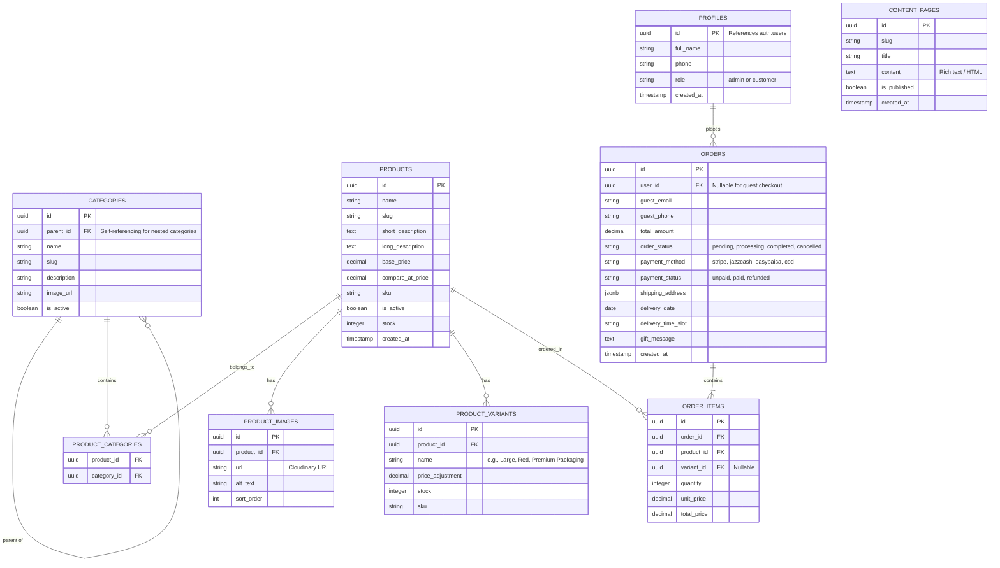

# Phase 2: Information Architecture & Database Schema

We are now establishing the core foundation of the application. The architecture is designed to support the premium florist e-commerce platform MVP while remaining flexible for future multi-city, multi-vendor, and multi-language features.

## 1. Information Architecture
The site will follow this structure:
- **Public Storefront:**
  - **Home:** Dynamic sections (Hero, Featured, Categories, Testimonials)
  - **Shop:** Browse all products with filters
  - **Categories:** Dynamic routing `/[category-slug]` (e.g., `/flower-bouquets`, `/cakes`)
  - **Product Detail:** `/[category-slug]/[product-slug]`
  - **Checkout Flow:** `/cart` -> `/checkout` -> `/order-confirmation`
  - **Content Pages:** `/about`, `/contact`, `/policies/[slug]`
- **Customer Portal:**
  - `/account/orders`, `/account/wishlist`, `/account/addresses`
- **Admin Dashboard:**
  - `/admin/products`, `/admin/orders`, `/admin/categories`, `/admin/settings` (Requires `admin` role)

## 2. Database Entity-Relationship Diagram (ERD)

The database will be hosted on Supabase (PostgreSQL). We rely on Supabase Auth for authentication, and we use a `profiles` table to store extended user data (roles, phone numbers).

## 3. Key Design Decisions & Future-Proofing
- **UUIDs over Auto-Increment IDs:** Used for all primary keys to ensure global uniqueness (crucial for future multi-tenant/vendor scaling).
- **Nested Categories:** The `parent_id` on the `categories` table allows for unlimited nesting (e.g., `Occasions -> Mother's Day`).
- **Flexible Checkout:** The `orders` table supports `guest_email` and `guest_phone`, meaning users do NOT need an account to checkout.
- **Delivery Time Tracking:** `delivery_date` and `delivery_time_slot` are explicitly tracked in the `orders` table, as flower delivery is time-sensitive.
- **Row Level Security (RLS):** 
  - `admin` role has full read/write.
  - `customer` role can only read active products, and read/update their own profile and orders.
  - `anon` (unauthenticated) can only read active products and create guest orders via secure edge functions.

## 4. Deliverables Generated
I have written the corresponding SQL migration script which creates these tables, sets up timestamps, triggers, and basic Row Level Security (RLS) policies.

> [!IMPORTANT]
> **User Review Required:**
> Please review the ERD and Information Architecture above. Once you approve this schema design, I will create the actual `.sql` migration files in the workspace and proceed to **Phase 3: Design System** (Tailwind CSS, component preview).
